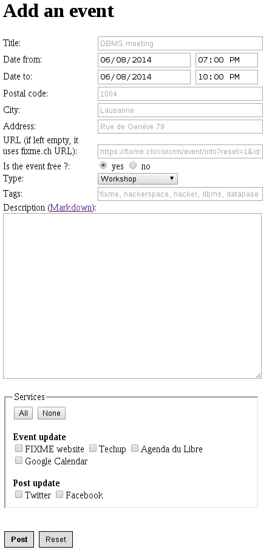

Events
======

Publish FIXME events on all the platforms

Installation
------------

* FIXME: There's still some hardcoded values in events.py preventing reuse as is

* Install the latest stable flask and dependencies

<pre>
apt-get install python-pip python-httplib2
pip install flask requests google-api-python-client \
           oauth2client python-gflags arrow twython \
           markdown
</pre>

* Create config.py and fill the empty fields

<pre>
cp config.py-example config.py
</pre>

* Apache example configuration for WSGI in /etc/apache2/sites-available/20_events

<pre>
<VirtualHost *:80>
    ServerName events.fixme.ch
    ServerSignature Off
    CustomLog /var/www/events/logs/access.log combined
    ErrorLog /var/www/events/logs/error.log
    DocumentRoot /var/www/events/htdocs

    <Directory /var/www/events/htdocs>
        AllowOverride None
        Options -Indexes
    </Directory>

    <Files *.pyc>
        deny from all
    </Files>

    WSGIProcessGroup events.fixme.ch
    WSGIScriptAlias / /var/www/events/htdocs/app.wsgi
    WSGIDaemonProcess events.fixme.ch user=www-data group=www-data threads=50
</VirtualHost>
</pre>

Screenshot
----------

